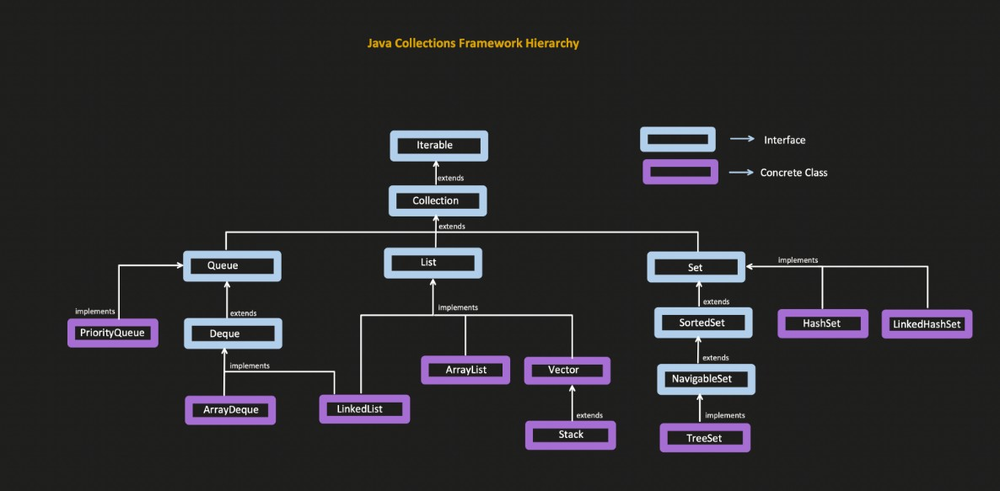

## List Interface (Java Collections)

### What is List?

* Ordered collection
* Allows duplicate elements
* Index-based access
* Can insert, remove, and access elements from **any position**



---

## List vs Queue

| Feature           | Queue               | List          |
| ----------------- | ------------------- | ------------- |
| Ordering          | FIFO                | Index-based   |
| Access            | Limited (head/tail) | Random access |
| Duplicate Allowed | Yes                 | Yes           |

---

## List Interface Methods (with Explanation & Time Complexity)

> **Note:** Time complexity is based on `ArrayList` implementation.

### 1. Index-Based Operations

| Method                                         |          Explanation                         | Time Complexity |
| ---------------------------------------------- | -------------------------------------------- | --------------- |
| `add(int index, E element)`                    | Inserts element at index and shifts elements | O(n)            |
| `addAll(int index, Collection<? extends E> c)` | Inserts collection starting at index         | O(n + m)        |
| `get(int index)`                               | Returns element at index                     | O(1)            |
| `set(int index, E element)`                    | Replaces element at index                    | O(1)            |
| `remove(int index)`                            | Removes element at index and shifts elements | O(n)            |

---

### 2. Search Operations

| Method                  |          Explanation           | Time Complexity |
| ----------------------- | ------------------------------ | --------------- |
| `indexOf(Object o)`     | Returns first occurrence index | O(n)            |
| `lastIndexOf(Object o)` | Returns last occurrence index  | O(n)            |

---

### 3. Iteration

| Method                    |          Explanation               | Time Complexity |
| ------------------------- | ---------------------------------- | --------------- |
| `listIterator()`          | Returns iterator from start        | O(1)            |
| `listIterator(int index)` | Returns iterator starting at index | O(1)            |

---

### 4. SubList

| Method                      | Explanation                                                  | Time Complexity |
| --------------------------- | ------------------------------------------------------------ | --------------- |
| `subList(int from, int to)` | Returns view from **from (inclusive)** to **to (exclusive)** | O(1) (view)     |

---

### 5. Replace (Functional Interface)

| Method                         | Explanation                        | Time Complexity |
| ------------------------------ | ---------------------------------- | --------------- |
| `replaceAll(UnaryOperator<E>)` | Replaces each element using lambda | O(n)            |

```java
list.replaceAll(val -> val * -1);
```

---

### 6. Sorting

| Method             | Explanation                 | Time Complexity |
| ------------------ | --------------------------- | --------------- |
| `sort(Comparator)` | Sorts list using comparator | O(n log n)      |

```java
list.sort((a, b) -> a - b);
```

---

## Difference: add vs set

| add               | set               |
| ----------------- | ----------------- |
| Inserts element   | Replaces element  |
| Shifts elements   | No shifting       |
| Can increase size | Size remains same |

---

## Complete ArrayList Program (All Methods)

```java
import java.util.*;

public class Main 
{
    public static void main(String[] args) 
    {
        List<Integer> list = new ArrayList<>();

        // Add elements
        list.add(10);
        list.add(20);
        list.add(30);
        list.add(40);

        //Initial List: [10, 20, 30, 40]
        System.out.println("Initial List: " + list);

        // add at index
        list.add(2, 25);

        //After add at index 2: [10, 20, 25, 30, 40]
        System.out.println("After add at index 2: " + list);

        // addAll at index
        List<Integer> extra = Arrays.asList(50, 60);
        list.addAll(3, extra);

        //After addAll: [10, 20, 25, 50, 60, 30, 40]
        System.out.println("After addAll: " + list);

        // get

        //Element at index 1: 20
        System.out.println("Element at index 1: " + list.get(1));

        // set
        list.set(1, 15);

        //After set at index 1: [10, 15, 25, 50, 60, 30, 40]
        System.out.println("After set at index 1: " + list);

        // remove
        list.remove(3);

        //After remove index 3: [10, 15, 25, 60, 30, 40]
        System.out.println("After remove index 3: " + list);

        list.add(15);
        // After adding 15: [10, 15, 25, 60, 30, 40, 15]
        System.out.println("After adding 15: " + list);

        // indexOf & lastIndexOf

        //indexOf 15: 1
        System.out.println("indexOf 15: " + list.indexOf(15));

        //lastIndexOf 15: 6
        System.out.println("lastIndexOf 15: " + list.lastIndexOf(15));

        //indexOf 100: -1
        System.out.println("indexOf 100: " + list.indexOf(100));

        //lastIndexOf 100: -1
        System.out.println("lastIndexOf 100: " + list.lastIndexOf(100));

        // ListIterator (Forward)
        ListIterator<Integer> it = list.listIterator();
        System.out.print("Forward Iteration: ");
        while (it.hasNext())
        {
            System.out.print(it.next() + " ");
        }

        //Forward Iteration: 10 15 25 60 30 40 15
        System.out.println();

        //Backward Iteration
        System.out.print("Backward Iteration: ");
        while (it.hasPrevious())
        {
            System.out.print(it.previous() + " ");
        }

        //Backward Iteration: 15 40 30 60 25 15 10
        System.out.println();

        // ListIterator from index
        ListIterator<Integer> it2 = list.listIterator(2);
        System.out.print("Iterating from index 2: ");
        while (it2.hasNext())
        {
            System.out.print(it2.next() + " ");
        }

        //Iterating from index 2: 25 60 30 40 15
        System.out.println();

        // SubList
        List<Integer> sub = list.subList(1, 4);

        //SubList (1 to 4): [15, 25, 60]
        System.out.println("SubList (1 to 4): " + sub);

        // replaceAll
        list.replaceAll(val -> val * -1);

        //After replaceAll: [-10, -15, -25, -60, -30, -40, -15]
        System.out.println("After replaceAll: " + list);

        // sort
        list.sort((a, b) -> a - b);
        
        //After sort: [-60, -40, -30, -25, -15, -15, -10]
        System.out.println("After sort: " + list);
    }
}
```

---

## Key Takeaways

* `List` allows **duplicate + ordered + index-based** access
* `ArrayList` is fast for get/set, slow for insert/delete in middle
* `subList()` returns a **view**, not a new list
* `replaceAll` and `sort` internally use functional programming

---
