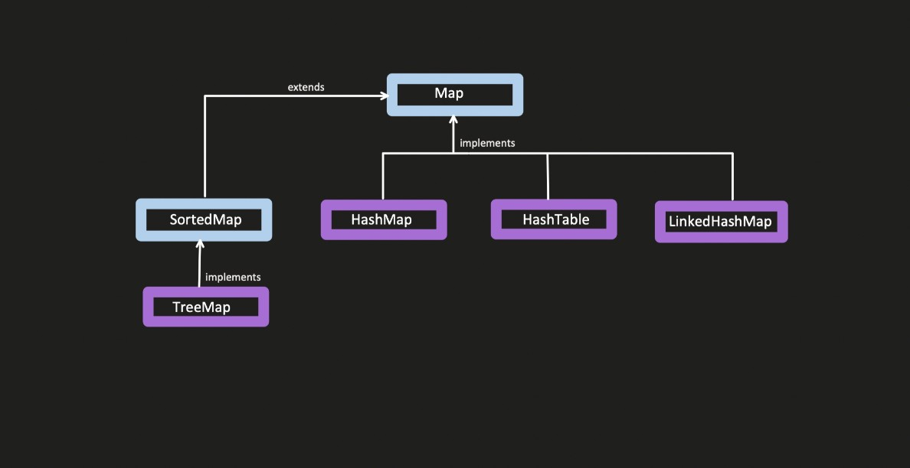
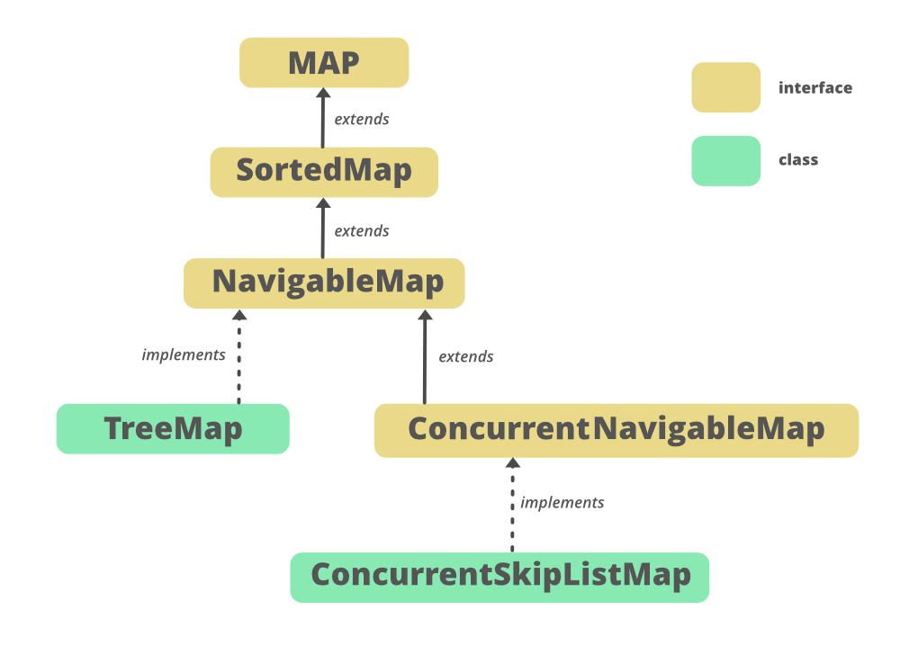

# Java Collections Framework – LinkedHashMap & TreeMap




---

## 1. LinkedHashMap

### 1.1 What is LinkedHashMap?

* `LinkedHashMap` is a **child class of HashMap**.
* It behaves **exactly like HashMap** in terms of hashing and performance **but** additionally **maintains order**.
* Order is maintained using a **doubly linked list**.

```java
public class LinkedHashMap<K,V> extends HashMap<K,V> implements Map<K,V>
```

---

### 1.2 Ordering in LinkedHashMap

LinkedHashMap supports **two types of ordering**:

#### 1️⃣ Insertion Order (default)

* Maintains the order in which elements are inserted.
* If you insert keys as: `1, 21, 23, 141, 25`
* Iteration will return them in the **same order**.

#### 2️⃣ Access Order (optional)

* Maintains order based on **recent access**.
* **Least recently used (LRU)** elements come first.
* **Most recently accessed** elements move to the **end**.
* Enabled using constructor parameter `accessOrder = true`.

---

### 1.3 Why LinkedHashMap Maintains Order?

* Internally, it maintains a **doubly linked list** in addition to the hash table.
* Each node contains:

  * `hash`
  * `key`
  * `value`
  * `next` (for collision chain)
  * `before` (previous element in linked list)
  * `after` (next element in linked list)

```java
static class Entry<K,V> extends HashMap.Node<K,V> {
    Entry<K,V> before, after;
}
```

---

### 1.4 Internal Working (Insertion Order)

1. Hash is calculated using key
2. Bucket index = `hash % capacity`
3. Node is inserted like HashMap
4. Additionally:

   * New node is appended at the **end** of doubly linked list
   * `before` and `after` pointers are updated

#### Iteration happens via:

```java
for (Entry<K,V> e = head; e != null; e = e.after) {
    // iteration in insertion order
}
```

---

### 1.5 Example – Insertion Order

```java
import java.util.*;

public class Main
{
    public static void main(String[] args) throws InterruptedException
    {
        Map<Integer, String> map = new LinkedHashMap<>();
        map.put(1, "A");
        map.put(21, "B");
        map.put(23, "C");
        map.put(141, "D");
        map.put(25, "E");

        for (Map.Entry<Integer, String> entry : map.entrySet())
        {
            System.out.println(entry.getKey() + " -> " + entry.getValue());
        }
    }
}
```

**Output:**

```
1 -> A
21 -> B
23 -> C
141 -> D
25 -> E
```

---

### 1.6 Access Order Example (LRU Behavior)

```java
import java.util.*;

public class Main
{
    public static void main(String[] args) throws InterruptedException
    {
        Map<Integer, String> map = new LinkedHashMap<>(16, 0.75f, true);

        map.put(1, "A");
        map.put(21, "B");
        map.put(23, "C");
        map.put(141, "D");
        map.put(25, "E");

        map.get(23); // accessed

        for (Map.Entry<Integer, String> entry : map.entrySet())
        {
            System.out.println(entry.getKey());
        }
    }
}
```

**Output Order:**

```
1, 21, 141, 25, 23
```

➡️ `23` moves to the end because it was **recently accessed**.

---

### 1.7 LinkedHashMap for Caching (LRU Cache)

* Very useful for **cache implementations**.
* Least frequently used items are at the **start**.
* Most frequently used items are at the **end**.

---

### 1.8 Time Complexity

| Operation | Average | Worst           |
| --------- | ------- | --------------- |
| get       | O(1)    | O(n) / O(log n) |
| put       | O(1)    | O(n) / O(log n) |

> Same as HashMap (treeification applies).

---

### 1.9 Thread Safety

* `LinkedHashMap` is **NOT thread‑safe**.
* Can be made thread‑safe using:

```java
Map<Integer, String> syncMap = Collections.synchronizedMap(new LinkedHashMap<>());
```

---

## 2. TreeMap

### 2.1 What is TreeMap?

* `TreeMap` stores data in **sorted order**.
* Sorting is based on:

  * **Natural ordering** of keys
  * OR **custom Comparator**

```java
TreeMap<K,V> implements NavigableMap<K,V>
```

---

### 2.2 Internal Data Structure

* Uses **Red‑Black Tree** (self‑balancing BST)
* Each node contains:

  * key
  * value
  * parent
  * left
  * right

```java
static final class Entry<K,V> {
    K key;
    V value;
    Entry<K,V> left;
    Entry<K,V> right;
    Entry<K,V> parent;
}
```

---

### 2.3 Time Complexity

| Operation | Time     |
| --------- | -------- |
| get       | O(log n) |
| put       | O(log n) |
| remove    | O(log n) |

> Slower than HashMap but guarantees ordering.

---

### 2.4 TreeMap – Natural Sorting Example

```java
import java.util.*;

public class Main
{
    public static void main(String[] args) throws InterruptedException
    {
        Map<Integer, String> map = new TreeMap<>();
        map.put(21, "B");
        map.put(13, "C");
        map.put(11, "D");
        map.put(5, "A");

        System.out.println(map);
    }
}
```

**Output:**

```
{5=A, 11=D, 13=C, 21=B}
```

---

### 2.5 TreeMap with Custom Comparator (Descending Order)

```java
import java.util.*;

public class Main
{
    public static void main(String[] args) throws InterruptedException
    {
        Map<Integer, String> map = new TreeMap<>((a, b)-> b-a);
        map.put(21, "B");
        map.put(13, "C");
        map.put(11, "D");
        map.put(5, "A");

        System.out.println(map);
    }
}
```

**Output:**

```
{21=B, 13=C, 11=D, 5=A}
```

---

## 3. SortedMap Methods

```java
import java.util.*;

public class Main
{
    public static void main(String[] args) throws InterruptedException
    {
        SortedMap<Integer, String> map = new TreeMap<>();
        map.put(21, "B");
        map.put(13, "C");
        map.put(11, "D");
        map.put(5, "A");

        // {5=A, 11=D, 13=C, 21=B}
        System.out.println(map);

        //{5=A}
        System.out.println(map.headMap(11));

        //{11=D, 13=C, 21=B}
        System.out.println(map.tailMap(11));

        System.out.println(map.firstKey()); // 5
        System.out.println(map.lastKey()); // 21
    }
}
```

| Method     | Description          |
| ---------- | -------------------- |
| headMap(k) | keys < k (exclusive) |
| tailMap(k) | keys ≥ k             |
| firstKey() | smallest key         |
| lastKey()  | largest key          |

---

## 4. NavigableMap Methods (Very Important)

```java
import java.util.*;

public class Main
{
    public static void main(String[] args) throws InterruptedException
    {
        NavigableMap<Integer, String> map = new TreeMap<>();
        map.put(1, "A");
        map.put(21, "B");
        map.put(23, "C");
        map.put(25, "D");
        map.put(141, "E");

        // {1=A, 21=B, 23=C, 25=D, 141=E}
        System.out.println(map);
    }
}
```

Current order (ascending):
`{1=A, 21=B, 23=C, 25=D, 141=E}`

---

## 1️⃣ Lower / Floor Methods

| Method        | Meaning                                    | Condition | Example Call       | Output |
| ------------- | ------------------------------------------ | --------- | ------------------ | ------ |
| `lowerKey(k)` | Greatest key **strictly less than** `k`    | `< k`     | `map.lowerKey(23)` | `21`   |
| `floorKey(k)` | Greatest key **less than or equal to** `k` | `≤ k`     | `map.floorKey(23)` | `23`   |
|               |                                            |           | `map.floorKey(24)` | `23`   |

📌 **Interview Tip**

* **Lower → Strictly less**
* **Floor → Equal allowed**

---

## 2️⃣ Higher / Ceiling Methods

| Method          | Meaning                                       | Condition | Example Call         | Output |
| --------------- | --------------------------------------------- | --------- | -------------------- | ------ |
| `higherKey(k)`  | Smallest key **strictly greater than** `k`    | `> k`     | `map.higherKey(23)`  | `25`   |
| `ceilingKey(k)` | Smallest key **greater than or equal to** `k` | `≥ k`     | `map.ceilingKey(23)` | `23`   |
|                 |                                               |           | `map.ceilingKey(24)` | `25`   |

📌 **Interview Tip**

* **Higher → Strictly greater**
* **Ceiling → Equal allowed**

---

## 3️⃣ Entry Variants (Key + Value)

| Method            | What it Returns             | Rule  | Example Call           | Output |
| ----------------- | --------------------------- | ----- | ---------------------- | ------ |
| `lowerEntry(k)`   | Entry just less than `k`    | `< k` | `map.lowerEntry(23)`   | `21=B` |
| `floorEntry(k)`   | Entry ≤ `k`                 | `≤ k` | `map.floorEntry(23)`   | `23=C` |
| `higherEntry(k)`  | Entry just greater than `k` | `> k` | `map.higherEntry(23)`  | `25=D` |
| `ceilingEntry(k)` | Entry ≥ `k`                 | `≥ k` | `map.ceilingEntry(24)` | `25=D` |

📌 **Key vs Entry**

* `Key` → returns only **key**
* `Entry` → returns **key + value**

---

## 4️⃣ Polling Entries (Remove + Return)

| Method             | Action                 | Removes? | Example Call           | Output  | Map After        |
| ------------------ | ---------------------- | -------- | ---------------------- | ------- | ---------------- |
| `pollFirstEntry()` | Returns smallest entry | ✅ Yes    | `map.pollFirstEntry()` | `1=A`   | `{21,23,25,141}` |
| `pollLastEntry()`  | Returns largest entry  | ✅ Yes    | `map.pollLastEntry()`  | `141=E` | `{1,21,23,25}`   |

📌 **Poll = Fetch + Delete**

---

## 5️⃣ Reverse Map Methods

| Method               | Description                       | Example Output                   |
| -------------------- | --------------------------------- | -------------------------------- |
| `descendingMap()`    | Returns map in **reverse order**  | `{141=E, 25=D, 23=C, 21=B, 1=A}` |
| `descendingKeySet()` | Returns keys in **reverse order** | `[141, 25, 23, 21, 1]`           |

📌 These are **views**, not new maps (changes reflect both ways).

---


## 5. Comparison Summary

| Feature         | HashMap    | LinkedHashMap      | TreeMap        |
| --------------- | ---------- | ------------------ | -------------- |
| Order           | ❌          | Insertion / Access | Sorted         |
| Data Structure  | Hash Table | Hash Table + DLL   | Red‑Black Tree |
| Time Complexity | O(1)       | O(1)               | O(log n)       |
| Null Keys       | 1 allowed  | 1 allowed          | ❌              |
| Thread Safe     | ❌          | ❌                  | ❌              |

---

## 6. Key Takeaways

* **LinkedHashMap** = HashMap + Order (DLL)
* **Access order LinkedHashMap** is ideal for **LRU Cache**
* **TreeMap** guarantees **sorted keys**
* TreeMap is slower but predictable
* Understanding Map ⇒ Set becomes very easy

---

